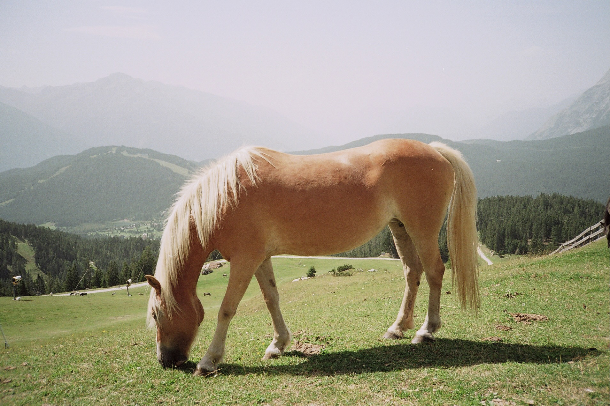
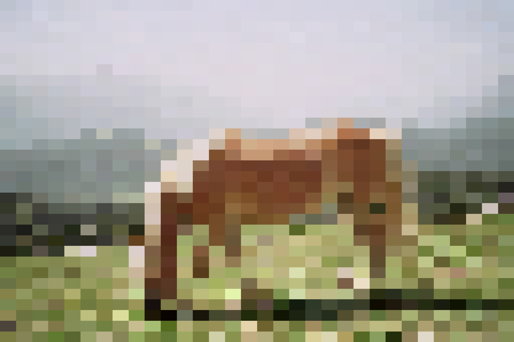

# smolres

**Turn your high-resolution images into pixelated, low-res magic.**

smolres is a Rust CLI tool that pixelates images by reducing their resolution and enlarging blocks of pixels. Whether you want to turn your precious high-res images into blocky pixel art or just reduce image sizes for some retro flair, smolres makes it easy and fun.

This projects purpose is to learn Rust for me.

## Example

<table>
  <tr>
    <td>

**Before**



</td>
<td>

**Nearest Neighbor (Resolution 32)**



</td>

  </tr>
</table>

## How to install

1. Build the project

```shell
cargo build
```

2. Install it globally. If you want to use smolres from anywhere:

```shell
cargo install --path .
```

3. Check it out

```shell
smolres --help
smolres --input ./data/input_image.jpeg --resolution 32

```

## Roadmap

### Core functionality

- [x] Basic CLI setup with clap for argument parsing.
- [x] Decode JPEG to raw RGB (using png or jpeg-decoder).
- [x] Implement pixelation algorithm (downscale to a virtual grid, then upscale).
- [x] Implement output saving (as JPEG).
- [x] Handle basic error cases (invalid files, missing arguments).
- [ ] Implement bit-depth reduction (2-bit, 4-bit color quantization).

### Advanced features

- [ ] Add batch processing (process an entire folder of images).
- [ ] Add progress bar (using indicatif).
- [ ] Add other interpolation algorithms
- [ ] Add other file types .png, .jpg, ..
